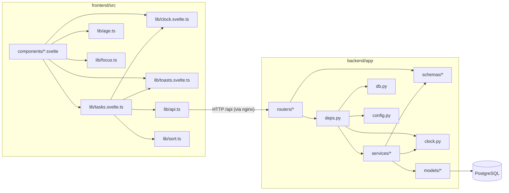
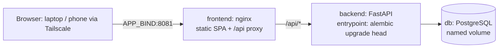
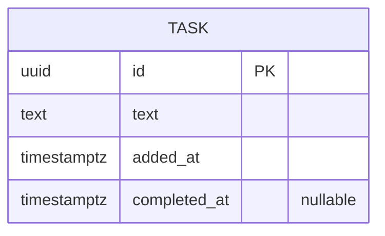

# Architecture Spine — Todo App

## Design Paradigm

**Client-server, one origin.** The browser only ever talks to nginx. nginx serves the static SPA and reverse-proxies `/api/*` to FastAPI on the internal compose network.

- **Backend: layered, synchronous.** `router → service → model → DB`. Endpoints are plain `def` with a sync `Session`, and there is no `async def` in app code. Routers are skinny: they parse the request, call one service method and return. Services are classes whose collaborators come in through the constructor. Queries are classmethods on the SQLModel model. Schemas live in `app/schemas/`.
- **Frontend: single store; functional core, imperative shell.** Pure modules (`sort`, `age`) hold the rules. One runes store (`tasks.svelte.ts`) holds all task state and does all the I/O. Components render state and call store actions.



Arrows are the only dependencies allowed. Nothing points back up the chain. The composition roots (`app/main.py`, `App.svelte`) may import anything, and `routers/health.py` and `routers/testing.py` may import `db.py` (`get_session`) and `models/` directly. `routers/testing.py` also imports `clock.py` and `services/testing_task_service.py`, because it builds its own service (AD-14).

## Invariants & Rules

### AD-1 — Frontend stack is Svelte 5 on plain Vite [ADOPTED]

- **Binds:** all frontend units
- **Prevents:** mixed paradigms; SvelteKit routes or server files that break the static build
- **Rule:** Svelte 5 (runes) + TypeScript, scaffolded from the Vite `svelte-ts` template. There is one root `App.svelte`, with no router and no SvelteKit. Build output is static files only.

### AD-2 — One origin; the frontend calls relative `/api` paths [ADOPTED]

- **Binds:** frontend `lib/api.ts`, nginx config, Vite dev config, backend routing
- **Prevents:** CORS config, a baked-in API base URL, env-specific frontend builds
- **Rule:** Every backend route is mounted under the `/api` prefix. nginx proxies `/api/*` to `backend` without rewriting the path. In dev, Vite `server.proxy` does the same. Frontend code uses only relative `/api/...` URLs. The backend has no CORS middleware.

### AD-3 — HTTP contract for tasks [ADOPTED]

- **Binds:** FR-1, FR-5, FR-11, FR-12, FR-13, NFR-4; backend routers and frontend `lib/api.ts`
- **Prevents:** two sides shaping endpoints, verbs or payloads differently
- **Rule:**

| Call | Request | Success |
|---|---|---|
| `GET /api/tasks` | none | `200` array of Task, in FR-6 order (AD-6) |
| `POST /api/tasks` | `{"text": str}` | `201` Task |
| `PUT /api/tasks/{id}/tick` | none | `200` Task (`completed_at` set) |
| `PUT /api/tasks/{id}/untick` | none | `200` Task (`completed_at` null) |
| `DELETE /api/tasks/{id}` | none | `204` |
| `GET /api/health` | none | `200` only if the DB answers, otherwise `503 service_unavailable` |
| `GET /api/docs`, `GET /api/openapi.json` | none | OpenAPI UI and schema, including the AD-5 error shape |

Task = `{"id": uuid, "text": str, "added_at": ts, "completed_at": ts | null}`, where `ts` is always `YYYY-MM-DDTHH:MM:SS.sssZ` (AD-7). The TS `Task` type lives in `lib/api.ts`. `tick` and `untick` are idempotent: repeating one returns the same state. The client never sends a timestamp.

### AD-4 — IDs are server-generated UUIDs; rows use a separate client key [ADOPTED]

- **Binds:** FR-1, FR-16; `Task` model, `tasks.svelte.ts`, list components
- **Prevents:** rows remounting when an add is confirmed (`animate:flip` jumps, focus is lost); actions sent against a temporary ID
- **Rule:** The backend generates `id` (UUID4). The frontend gives every task a client `key` when it first sees the task: a random key for an optimistic add, or the server `id` for a task that arrives from a GET. The key never changes, even when a temporary task gets its server `id`. Svelte `{#each}` blocks key by `key`, never by `id`. The API is only ever called with a server `id`.

### AD-5 — Error responses carry a machine code [ADOPTED]

- **Binds:** FR-3, FR-16, FR-17, FR-18; every backend error path and the frontend error handling
- **Prevents:** the client parsing messages or guessing from status codes; FastAPI's default 422 list shape leaking through
- **Rule:** Every non-2xx response the app produces has the body `{"detail": str, "code": str}`. Exception handlers turn request-validation errors and domain errors into this shape. Backend codes are `snake_case`: `text_too_long`, `validation_error`, `task_not_found`, `not_found` (unknown route), `method_not_allowed` (wrong method, `405`), `service_unavailable`, `internal_error`. Every app error is a subclass of `AppError` (`app/exceptions.py`), which carries its own `status_code`, `code` and default `detail` (plus optional `headers`, and a `log` flag set for server-side faults). Code raises these; one handler in `app/errors.py` catches `AppError` and formats the response. Framework and library errors (request validation, Starlette HTTP errors, SQLAlchemy `OperationalError`/`StaleDataError`, anything unhandled) are translated into an `AppError` subclass and go through that same handler. OpenAPI documents this shape in place of FastAPI's `HTTPValidationError`. `lib/api.ts` maps in this order: fetch failure or a 10 s timeout → `network_error`; status 413 → `text_too_long`; status 502/503/504 → `unavailable`; otherwise the JSON `code`; a non-JSON body → `unavailable`. nginx sets `client_max_body_size 64k`. The frontend branches on `code` only, and a toast never shows `detail` or `code`.

### AD-6 — The backend owns ordering; the frontend mirror is fixture-locked [ADOPTED]

- **Binds:** FR-6, FR-11, FR-12, FR-16; `Task.list_ordered()`, frontend `lib/sort.ts`
- **Prevents:** the backend order and the optimistic frontend order drifting apart
- **Rule:** The canonical order is: open tasks by `added_at` ascending, then completed tasks by `completed_at` descending, with ties broken by `id` ascending. `Task.list_ordered()` implements it, and `GET /api/tasks` returns it. `lib/sort.ts` mirrors it and is used only to place tasks between server responses. It compares `Date.parse` numbers, never strings. A pending task sorts on provisional timestamps from `clock.sample()` (AD-8), and ties with no server `id` break by `key`. Both implementations are tested against `contracts/ordering-cases.json` (input tasks → expected id order), which includes a same-millisecond tie. Nothing else sorts tasks.

### AD-7 — The server clock is the only source of stored time [ADOPTED]

- **Binds:** FR-14, FR-15, NFR-7; `TaskService`, `Task` model, Alembic migrations
- **Prevents:** timestamps from two sources (Python and the DB `now()`); naive datetimes; tests that can't pin time
- **Rule:** A `Clock` dependency (`clock.py`, returning `datetime.now(UTC)` truncated to milliseconds) is injected into `TaskService`. It is the only producer of `added_at` and `completed_at`. The columns are `timestamptz` with no DB default. The DB session `TimeZone` is `UTC`. A Pydantic serializer always emits the fixed-width form `YYYY-MM-DDTHH:MM:SS.sssZ`, which an integration test asserts with a regex. Tests inject a fixed clock. In test mode only, the clock accepts an offset (AD-14).

### AD-8 — One frontend clock; pure age functions [ADOPTED]

- **Binds:** FR-7, FR-9, FR-10, FR-15, NFR-7; `lib/clock.svelte.ts`, `lib/age.ts`
- **Prevents:** scattered `Date.now()` calls; ages drifting out of step or impossible to fake in tests
- **Rule:**
  - `lib/clock.svelte.ts` exports `clock.now` (reactive epoch ms) and `clock.sample()`, which reads the wall clock, updates `now` and returns the value. `now` refreshes every 30 s, on `visibilitychange` → visible, on window `focus` and on `pageshow`. The clock module is the only `Date.now()` call site, and every provisional timestamp comes from `sample()`.
  - `lib/age.ts` is pure: `(timestamp, now)` → label, colour and spoken age, with negative ages clamped to "now".
  - Timers (the 3 s hold, 5 s toasts, the 30 s poll) use global `setTimeout`/`setInterval`. Only age rendering reacts to changes in `now`. Unit tests fake time with `vi.useFakeTimers()` + `vi.setSystemTime()`, and the clock has no private test hook.
  - Every E2E spec calls `page.clock.install()` before its first `goto` and moves time only with `fastForward`/`runFor`, together with the server clock (AD-14). `setFixedTime` and `pauseAt` are not used.

### AD-9 — One store owns task state; rollback through a confirmed state plus per-task op queues [ADOPTED]

- **Binds:** FR-1, FR-4, FR-11, FR-12, FR-13, FR-16, FR-17; `lib/tasks.svelte.ts`, all components
- **Prevents:** components doing their own optimistic logic; tick/untick races restoring a stale state; actions on an unconfirmed add being lost or sent with a temporary ID
- **Rule:**
  - `tasks.svelte.ts` is the only thing that changes task state and the only caller of `lib/api.ts`. Its interface:
    - `rows`: the final render order, with the held task first, then the sorted rest, including unconfirmed rows during loading.
    - `loadState` and `retry()` (AD-10).
    - `add(text): Promise<void>`: the list updates at once. The promise resolves on confirm and rejects with `{text: string | null}`.
    - `tick(key)`, `untick(key)` and `remove(key)`, which always take the client `key`.
  - The store never moves focus (AD-18).
  - The store keeps, per task, the last **confirmed** server state plus a FIFO queue of **pending** ops.
  - `rows` = confirmed state with the pending ops applied on top, ordered by `lib/sort.ts`. The store owns `heldKey` and its 3 s hold timer (UX FR-4 rules).
  - Each task's ops go to the server one at a time. Ops on an unconfirmed add wait until its POST returns the `id`.
  - When an op fails, it is dropped together with the ops queued after it for that task, and the view falls back to the confirmed state. The store raises the toast (AD-17). A failed `add()` rejects with `{text}`, and the input puts the text back only if the input is empty. If a failed add had ops queued behind it, it rejects with `{text: null}` (UX rule). If any mutation fails with `network_error` or `unavailable`, the store also triggers an immediate GET, so a change that did reach the server shows up within one round trip.
  - The client never retries a POST on its own. Pending ops are never persisted or replayed after a reload.
  - There is no `beforeunload` warning. A reload with ops in flight can lose them (accepted, UX OQ2).

### AD-10 — Background sync merges by confirmation sequence [ADOPTED]

- **Binds:** FR-5, FR-7, FR-14, FR-17; `lib/tasks.svelte.ts`
- **Prevents:** a slow GET overwriting a newer confirmed change or bringing back a deleted task; duplicate rows for an add; divergent load-failure handling; stale data when the phone and laptop share one server
- **Rule:**
  - The store exposes `loadState`: `loading | ready | load_failed`, plus a `retry()` action. While the state is `load_failed`, the list stays hidden and the persistent toast stays up (FR-17). Any successful GET sets `ready` and closes that toast.
  - Polling starts only after the first successful load. The store polls `GET /api/tasks` every 30 s while the tab is visible, pauses while it is hidden, and fetches immediately when it becomes visible again. Only one GET is in flight at a time. Once the state is `ready`, a failed poll is silent: it keeps the current list, and the next tick tries again.
  - A counter increments on every confirmed mutation, and each confirmed task records the counter value that confirmed it.
  - Each GET records the counter value **S** when it is sent. The merge only touches entries that have a confirmed server state, and unconfirmed adds are never removed by a GET. It replaces confirmed tasks whose value is ≤ S, keeps those whose value is > S, and removes confirmed tasks that are missing from the response only if their value is ≤ S. A task first seen in a GET is stamped with that GET's S.
  - A poll tick is skipped while any POST is in flight.
  - A confirmed delete, or a removal after a 404 (AD-11), leaves a tombstone `{id, seq}`. A GET sent at S ignores any task tombstoned with seq > S.
  - If a GET has already brought in a task and that task's own POST response then returns the same `id`, the two entries merge into one, which keeps the optimistic `key`.
  - Pending ops stay applied on top. Keys are preserved by `id`, and focus is never moved. This applies to the initial load and to every poll.

### AD-11 — Tasks deleted elsewhere [ADOPTED]

- **Binds:** FR-13, FR-16; `TaskService`, `lib/tasks.svelte.ts`
- **Prevents:** a false "It's back as it was" toast; a delete retried forever
- **Rule:** The backend returns `404` + `task_not_found` for a missing `id`, and also for a malformed one (not a UUID). On the client, `DELETE` → 404 counts as success. `tick`/`untick` → 404 removes the task locally with no rollback toast.

### AD-12 — Task text validation lives in the request schema

- **Binds:** FR-3, NFR-5; `schemas/task.py`, `TaskService`
- **Prevents:** the limit being checked in different places, or with different trimming
- **Rule:** `TaskCreate.text` is trimmed and must have 1–2000 characters after trimming. More than 2000 → `422 text_too_long`; empty after trimming → `422 validation_error`. The DB column is `TEXT NOT NULL` with no length limit. The frontend trims and ignores empty input before sending, but it never enforces the maximum itself.

### AD-13 — Task text is never HTML

- **Binds:** NFR-5; all components
- **Prevents:** XSS through task text
- **Rule:** Task text is rendered only through Svelte text interpolation. `{@html}` is forbidden anywhere in the app. The backend never interpolates strings into SQL; all queries go through SQLModel/SQLAlchemy expressions.

### AD-14 — Test-only seeding router, structurally gated [ADOPTED]

- **Binds:** NFR-7; `routers/testing.py`, `services/testing_task_service.py`, `app/main.py`, the E2E suite
- **Prevents:** seeding that bypasses the models; test endpoints reachable in a real run; test-only methods shipped on production services or models
- **Rule:** `POST /api/test/tasks` (accepts `text`, `added_ago_ms`, `completed_ago_ms`), `POST /api/test/reset` and `POST /api/test/clock` (sets or clears an offset on the backend `Clock`) live in `routers/testing.py`. 
  - **Bodies:** `POST /api/test/clock` takes `{"offset_ms": int}`, where 0 clears it. `POST /api/test/tasks` takes `{"text", "added_ago_ms", "completed_ago_ms" | null}`, relative to the server clock including the offset, and returns the Task. `POST /api/test/reset` deletes all tasks **and** resets the offset to 0.
  - **E2E helpers:** `seed(...)` runs before `page.goto` or is followed by a reload. `advance(ms)` calls `page.clock.fastForward(ms)` and adds `ms` to the server offset. E2E runs with one worker.
  - **Test-only use cases:** `seed` and `remove_all` live on `TestingTaskService(TaskService)` in `services/testing_task_service.py`, never on `TaskService` or the `Task` model. Only `routers/testing.py` imports that module, and it builds the service with its own `get_testing_task_service()` provider, so `deps.py` never imports test code.
  - **Gate:** The router is imported and mounted only when `APP_ENV=test`, and only the compose `test` profile sets that, so under the default config no test-only module is even imported. Seeding goes through the model layer. Backend tests assert that `/api/test/*` returns `404` under the default config, and that building the default app in a fresh interpreter loads neither `routers/testing.py` nor `services/testing_task_service.py`.

### AD-15 — Schema changes only through Alembic, with a migration guard test [ADOPTED]

- **Binds:** FR-14, NFR-8; `backend/alembic/`, backend entrypoint, test suite
- **Prevents:** `create_all()` in app code; multiple heads from parallel stories; models drifting from migrations
- **Rule:** The backend entrypoint runs `alembic upgrade head` and then starts uvicorn (`--factory app.main:create_app`, AD-21). App code never calls `create_all()`. Test fixtures may use `metadata.create_all` for speed. One dedicated migration test checks three things: there is exactly one head, `upgrade head` succeeds on an empty DB, and `alembic check` reports no drift.

### AD-16 — Runtime envelope: compose profiles, bind address, health [ADOPTED]

- **Binds:** NFR-4, NFR-5; `docker-compose.yml`, Dockerfiles, nginx config
- **Prevents:** tests wiping real data; profiles that are expected to swap services; the unauthenticated app exposed on every network; startup races
- **Rule:**
  - Every service belongs to a profile. `.env` is gitignored. Setup copies the committed `.env.example` to `.env`, which sets `COMPOSE_PROFILES=app`, so `docker-compose up` then runs the app. The README makes the copy a required step.

| Profile | Services | Published |
|---|---|---|
| `app` | `db`, `backend`, `frontend` (all `restart: unless-stopped`) | `${APP_BIND:-127.0.0.1}:8081` → `frontend` |
| `dev` | `db`, `backend-dev` (`--reload`, only `app/` and `alembic/` bind-mounted), `frontend-dev` (Vite dev server) | `8000`, `5173` on `127.0.0.1` |
| `test` | `db-test` (own volume; databases `todo_pytest` for pytest and `todo_e2e` for `backend-test`, the second created by an init script; no compose service points at `todo_pytest`), `backend-test` (`APP_ENV=test`), `frontend-test` | `127.0.0.1:8082` → `frontend-test`, `127.0.0.1:5436` → `db-test` (for pytest) |

  - Inside containers, uvicorn listens on `8000` and nginx on `8080`. Host ports are moved off 8080 and 5433 (app `8081`, test `8082`, `db-test` `5436`) so the stack runs beside a local Postgres and other dev servers (2026-09-30).
  - **nginx upstream:** `API_UPSTREAM` is `host:port` with no scheme. The config is `frontend/nginx/default.conf.template`, copied to `/etc/nginx/templates/`, with `proxy_pass http://${API_UPSTREAM};` and no URI part. `vite.config.ts` proxies `/api` to `http://${API_UPSTREAM ?? 'localhost:8000'}` with `server.host: true`. Compose sets `API_UPSTREAM` for `frontend`, `frontend-dev` and `frontend-test`.
  - **Postgres volumes:** Postgres 18 volumes mount at `/var/lib/postgresql`, not `/var/lib/postgresql/data`.
  - **Images:** multi-stage Dockerfiles. The frontend runtime is `nginxinc/nginx-unprivileged:1.30-alpine`, and the backend runtime is Python slim with a non-root `app` user. 
  - **Health checks:** app health checks live only in the Dockerfiles, and compose does not redefine them. The backend uses `python -c "import urllib.request; urllib.request.urlopen('http://127.0.0.1:8000/api/health')"` with `start_period` ≥ 30 s. The frontend uses busybox `wget -qO- http://127.0.0.1:8080/`. Compose defines only the `db` health check (`pg_isready`). Every `depends_on` uses `condition: service_healthy`.
  - **Security headers:** nginx sends `X-Content-Type-Options` and `Referrer-Policy` on all responses. `Content-Security-Policy: default-src 'self'` applies to the static `location /` only, so `/api/docs` keeps working (AD-19).
  - **Phone access:** through `tailscale serve` or `APP_BIND`, documented in the README. `.env.example` lists every variable, with its default.
  - **Logs:** stdout/stderr only.

### AD-17 — The toast and live-region API has one caller

- **Binds:** FR-16, FR-17, FR-18, NFR-1; `lib/toasts.svelte.ts`, the store, the toast and live-region components
- **Prevents:** doubled or missing screen-reader announcements; toast copy defined in two places; no owner for Retry
- **Rule:**
  - `lib/toasts.svelte.ts` exports `toasts` with:
    - `items`: at most 2, newest first, with the load-failure toast pinned.
    - `error(kind: 'add_failed' | 'add_too_long' | 'action_failed')`. The module owns the verbatim copy from EXPERIENCE.md.
    - `showLoadFailure()` and `hideLoadFailure()`, both idempotent.
    - `announce(kind, taskText)` for the success messages, `alert(text)`, and `dismiss(id)`.
  - Only the store calls `error`, `announce`, `showLoadFailure`, `hideLoadFailure` and `alert`. It announces success when the optimistic change is applied, and it builds the empty-state suffix after the last delete. It maps error codes to kinds.
  - The Retry button in the toast component calls `tasks.retry()`.
  - One `LiveRegions.svelte`, rendered at first paint, holds the polite and alert regions. No other element has `aria-live` or a `status`/`alert` role.

### AD-18 — One module moves focus

- **Binds:** FR-2, NFR-1; `lib/focus.ts`, all components
- **Prevents:** components guessing the input's id; different "is this a phone" tests; the store touching the DOM
- **Rule:** `lib/focus.ts` is the only code that moves focus programmatically. It exports:
  - `registerInput(el)`
  - `returnToInput()`, which calls `focus({ preventScroll: true })` and does nothing unless `matchMedia('(hover: hover)')` matches. That query is the single laptop-vs-phone test (UX).
  - `installSafetyNet()` and `installTypeToFocus()`

  Components call `returnToInput()` after invoking a store action.

### AD-19 — The production build is CSP-clean

- **Binds:** NFR-5; `frontend/index.html`, global CSS, nginx config, the E2E suite
- **Prevents:** fonts and the no-flash theme script that work in Vite dev but get blocked behind nginx
- **Rule:**
  - No inline `<script>` and no third-party origins.
  - Inter and JetBrains Mono are self-hosted through `@fontsource/*`, bundled by Vite.
  - The pre-paint theme code is `public/theme-init.js`, loaded with a blocking `<script src>` in `<head>`.
  - E2E fails on any `securitypolicyviolation`.

### AD-20 — Backend wiring through FastAPI dependencies

- **Binds:** all backend units, backend tests
- **Prevents:** a mix of sync and async sessions; services built in different ways; tests patching module globals
- **Rule:**
  - `app/db.py` owns `make_engine()` and `get_session()`, which yields a sync `Session` on the engine that `create_app` puts on `app.state` (AD-21), using the `postgresql+psycopg://` URL.
  - `app/deps.py` owns `get_clock()` and `get_task_service()`. Routers receive `TaskService` only through `Depends(get_task_service)`. The one exception is `routers/testing.py`, which owns `get_testing_task_service()` for `TestingTaskService` (AD-14).
  - Tests swap the session and the clock through `app.dependency_overrides`.

### AD-21 — Backend configuration is read only through Pydantic Settings

- **Binds:** all backend units, `backend/alembic/env.py`, backend tests, backend compose services
- **Prevents:** `os.environ` reads scattered across modules; config defaults defined in two places; a mistyped or leaked `APP_ENV` mounting or hiding the testing router; tests patching environment variables; config fixed at import time where tests cannot reach it
- **Rule:**
  - **One owner.** `app/config.py` defines `Settings(BaseSettings)` and a cached `get_settings()`. It is the only app code that reads the environment. Fields: `database_url: str` (required, no default) and `app_env: Literal["app", "test"] = "app"`. Invalid, unknown or missing values fail at startup.
  - **Sources, highest first:** init arguments, then real environment variables, then `backend/.env`. `model_config` pins `env_file` to the absolute path of `backend/.env` (resolved from `config.py`, never the working directory), with `extra="ignore"` and no `env_prefix`. `backend/.env` must be gitignored (the root `.gitignore` entry `.env` covers it) and must be listed in `backend/.dockerignore`. The root `.env.example` stays the one list of every variable.
  - **Nothing is read at import.** The app is built by `create_app(settings: Settings | None = None)`, which falls back to `get_settings()`. uvicorn starts it with `--factory app.main:create_app`, and there is no module-level `app`. `create_app` stores the settings and the engine it builds from `settings.database_url` on `app.state`. `get_session()` and a `get_settings` dependency read `app.state`.
  - **One test-mode switch.** Everything that behaves differently in test mode (the AD-14 router mount, the AD-7 clock offset) reads `settings.app_env`, never the environment.
  - **Alembic.** `alembic/env.py` uses, in order: a connection passed in `config.attributes["connection"]`, then `sqlalchemy.url` if the caller set it, then `get_settings().database_url`. The AD-15 migration test passes its scratch URL this way.
  - **Tests.** Tests never patch the environment. They build `Settings(_env_file=None, …)` and pass it to `create_app`. A second session-scoped app built with `app_env="test"` is allowed for testing-router tests. `TEST_DATABASE_URL` is read by a separate test-only `BaseSettings` in `backend/tests/`, with the same `env_file` and `extra="ignore"`. The app's `Settings` never reads it.
  - **Compose.** Every backend service (`backend`, `backend-dev`, `backend-test`) sets `DATABASE_URL` and `APP_ENV` explicitly, so a host `backend/.env` can never decide them in a container.

## Consistency Conventions

| Concern | Convention |
| --- | --- |
| JSON field names | `snake_case` on the wire. TS types mirror them. No alias generators. |
| Timestamps | UTC `timestamptz`, millisecond precision. The wire format is `YYYY-MM-DDTHH:MM:SS.sssZ`. The frontend converts with `Date.parse` and never does time-zone arithmetic. |
| IDs | UUID strings on the wire. The frontend's client `key` is separate from `id` (AD-4). |
| Backend naming | `routers/tasks.py`, `services/task_service.py` (`TaskService`), `models/task.py` (`Task`), `schemas/task.py` (`TaskCreate`, `TaskRead`). |
| Frontend naming | Components are `PascalCase.svelte` in `src/components/`. Logic lives in `src/lib/*.ts`, and runes modules are named `*.svelte.ts`. |
| Config | Environment variables (`DATABASE_URL`, `TEST_DATABASE_URL`, `APP_ENV`, `APP_BIND`, `API_UPSTREAM`, `COMPOSE_PROFILES`), with defaults only in compose and `.env.example`; the one exception is the `app_env` default, which lives in `Settings`. The backend reads them only through Pydantic Settings, which also loads an uncommitted `backend/.env` (AD-21). The frontend has no runtime config. The theme choice lives only in the browser's `localStorage`. |
| Errors | `{detail, code}` (AD-5). No stack traces in responses. Unhandled exceptions → `500 internal_error`. |
| Logging | stdout/stderr, default uvicorn/nginx formats. |
| Backend tests | `uv run pytest` against its own `TEST_DATABASE_URL` (default `postgresql+psycopg://…@127.0.0.1:5436/todo_pytest` on `db-test`), with one rolled-back transaction per test and one app per session (plus one `app_env="test"` app for testing-router tests, AD-21). Integration tests cover every endpoint. The migration test (AD-15) creates and drops its own scratch database. Coverage uses `--cov-branch --cov-fail-under=70`. |
| Frontend tests | `npm test` / `npm run test:coverage` in `frontend/`: Vitest + `@testing-library/svelte` for `lib/*` and components. The clock is faked through `lib/clock.svelte.ts`. `coverage-v8` thresholds are 70 over `src/lib` and `src/components`. |
| E2E | `npm test` in `e2e/`: Playwright against the compose `test` stack (`:8082`), with one worker. Seeding and server time go through AD-14, browser time through `page.clock`, and API failures are injected with `page.route`. Accessibility checks use `@axe-core/playwright`. |
| Python deps | `uv` with `pyproject.toml` + `uv.lock` in `backend/`. |
| Lint / format | `ruff check` + `ruff format` for the backend. `svelte-check`, ESLint and Prettier for the frontend. |
| Docs | `README.md` at the root. QA reports and the AI integration log go in `docs/`. |

## Stack

| Name | Version |
| --- | --- |
| Python | 3.14 |
| FastAPI | 0.142 |
| SQLModel | 0.0.47 |
| Alembic | 1.20 |
| psycopg | 3.3 |
| uvicorn | 0.54 |
| SQLAlchemy | 2.0 (`<2.1`, required by SQLModel) |
| Pydantic | 2.13 |
| pydantic-settings | 2.15 |
| pytest | 9.1 |
| pytest-cov | 7.1 |
| uv | 0.12 |
| ruff | 0.16 |
| PostgreSQL | 18 |
| Node.js (build/dev) | 24 LTS |
| TypeScript | 6.0 (not 7: svelte-check supports TS 5–6 only) |
| Svelte | 5.57 |
| Vite | 8.3 |
| @sveltejs/vite-plugin-svelte | 7.3 |
| Vitest | 5.0 (fallback 4.1 if the first-story spike shows @testing-library/svelte is incompatible) |
| jsdom | 30 |
| svelte-check | 4.7 |
| @fontsource/inter, @fontsource/jetbrains-mono | 5.3 |
| @vitest/coverage-v8 | 5.0 |
| @testing-library/svelte | 5.4 |
| @playwright/test | 1.63 |
| @axe-core/playwright | 4.13 |
| nginx | `nginxinc/nginx-unprivileged:1.30-alpine` |

## Structural Seed





```text
/
  docker-compose.yml  .env  .env.example  README.md
  docs/                            # QA reports, AI integration log
  contracts/ordering-cases.json    # shared FR-6 fixtures (AD-6)
  backend/
    Dockerfile
    alembic/                       # migrations (AD-15)
    app/
      main.py                      # app factory; mounts testing router only if APP_ENV=test
      config.py                    # Settings, the only env reader (AD-21)
      db.py  deps.py               # engine/session, dependency providers (AD-20)
      clock.py                     # Clock dependency (AD-7)
      routers/tasks.py  routers/health.py  routers/testing.py
      services/task_service.py  services/testing_task_service.py   # the latter test-only (AD-14)
      models/task.py
      schemas/task.py
    tests/
  frontend/
    Dockerfile  nginx/default.conf.template  public/theme-init.js
    src/
      App.svelte
      components/
      lib/api.ts  lib/tasks.svelte.ts  lib/sort.ts  lib/clock.svelte.ts  lib/age.ts  lib/toasts.svelte.ts  lib/focus.ts
  e2e/                             # Playwright package
```

## Capability → Architecture Map

| Capability / Area | Lives in | Governed by |
| --- | --- | --- |
| Capture (FR-1–FR-4) | `components/` input, `tasks.add` | AD-3, AD-4, AD-9, AD-12 |
| List and ordering (FR-5, FR-6, FR-8, FR-17) | `Task.list_ordered`, `lib/sort.ts`, list components | AD-6, AD-10 |
| Live ages (FR-7, FR-9, FR-10) | `lib/clock.svelte.ts`, `lib/age.ts` | AD-8 |
| Tick / untick (FR-11, FR-12) | `PUT …/tick`, `PUT …/untick`, `tasks.tick/untick` | AD-3, AD-7, AD-9 |
| Delete (FR-13) | `DELETE /api/tasks/{id}`, `tasks.remove` | AD-3, AD-11 |
| Persistence and time (FR-14, FR-15) | `Task` model, Alembic, `clock.py` | AD-7, AD-15 |
| Optimistic updates and failures (FR-16–FR-18) | `lib/tasks.svelte.ts`, `lib/toasts.svelte.ts` | AD-5, AD-9, AD-11, AD-17 |
| Focus (FR-2) and accessibility (NFR-1) | `lib/focus.ts`, `LiveRegions.svelte` | AD-17, AD-18 |
| Security (NFR-5) | components, models, nginx | AD-13, AD-16, AD-19 |
| Operability (NFR-4) | compose, Dockerfiles, `/api/health` | AD-16 |
| Testability (NFR-7) | clocks, testing router, `contracts/` | AD-6, AD-7, AD-8, AD-14, AD-15 |

## Open Questions

1. **A failed background poll after a successful load stays silent (AD-10).** This is new UX behaviour, and UX should confirm it (EXPERIENCE.md).

## Deferred

- **A duplicate add after a lost response (accepted risk).** If the server commits a POST but the response is lost and the user presses Enter again, two tasks exist. The immediate GET after a network error (AD-9) shows the duplicate within one round trip, and the user deletes it. No idempotency key. Revisit if it happens in practice.

- **User accounts (NFR-6).** Adding them later needs an `owner_id` column, an auth dependency, and scoping in `TaskService`. Nothing here blocks that. Revisit if the app is ever shared.
- **Pagination / archiving completed tasks.** Out of scope for v1 (PRD §8.2). Revisit after two weeks of use (PRD OQ3).
- **CI pipeline.** The exercise doesn't require one. The test commands are defined in the README so CI can wrap them later.
- **HTTPS / TLS.** Provided by `tailscale serve` when accessed remotely. The local run is plain HTTP.
- **Observability beyond logs** (metrics, tracing). Not needed for a single-user local app.
- **Frontend component tree and UI details.** Owned by the UX spine (DESIGN.md, EXPERIENCE.md) and the stories.
- **Server-time offset for client clock drift.** Accepted: devices are NTP-synced and labels are minute-coarse (UX OQ1).
- **Performance check setup (NFR-2).** A story seeds 500 tasks through AD-14 and measures in Chrome DevTools. No architectural hook is needed.
- **Backups of the data volume.** Not needed for a personal local app. Revisit if the data starts to matter.
- **Rendering optimisations** (list virtualisation etc.). 500 rows is well within budget. Revisit only if NFR-2 fails.
